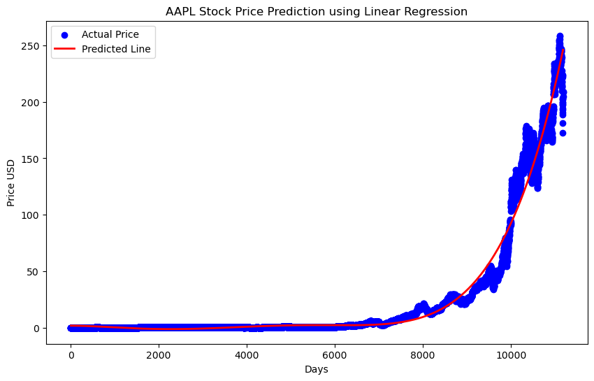

# Stock Prediction 📈 Analysis using Polynomial Regression Machine Learning Algorithm

This repository contains Python code for conducting stock prediction analysis using **Polynomial Regression**, a powerful machine learning algorithm. The analysis involves fetching historical stock data through **yfinance**, preprocessing it using **Pandas** and **NumPy**, implementing a polynomial regression model, and visualizing the predictions using **Matplotlib**.

## Stock Prediction

Stock prediction refers to the process of using historical data, statistical analysis, and various techniques, including machine learning algorithms, to forecast future movements or trends in stock prices. It is a challenging task due to the complex and often unpredictable nature of financial markets. Stock prediction can be approached using different methodologies, including fundamental analysis, technical analysis, and machine learning-based predictive modeling.

## About Stock Data

This model is trained using the **AAPL** stock data, but it can be used to predict the stock price for any company. By simply changing the stock ticker symbol, you can predict the price trends for any stock listed on Yahoo Finance.

**Ticker Symbol:** "AAPL" refers to the stock symbol for Apple Inc., a multinational technology company listed on the NASDAQ. You can replace it with any other valid ticker symbol (e.g., "GOOGL" for Alphabet Inc., "AMZN" for Amazon, etc.).

**Data Source:** The historical stock data is obtained from Yahoo Finance using the **yfinance** Python library. This data includes daily open, high, low, close prices, and trading volumes for a specific time range.

**Role in Analysis:** The stock data is utilized as the primary dataset for conducting stock prediction analysis within this project.

## Requirements

To run the code in this repository, you need to have the following libraries installed:

- Python
- NumPy
- yfinance
- Pandas
- Matplotlib
- scikit-learn

You can install the required libraries using pip:

```bash
pip install numpy yfinance pandas matplotlib scikit-learn
```

Just run the `model.ipynb` code to predict the stock market analysis.

## About libraries

- **NumPy:** NumPy is a fundamental library for numerical computing in Python. It provides support for arrays, matrices, and a wide variety of mathematical functions to perform operations on these data structures efficiently.

- **yfinance:** yfinance is a Python library that provides a simple interface to download historical market data from Yahoo Finance. It allows users to access stock market data such as historical prices, dividends, and split events.

- **Pandas:** Pandas is a powerful library for data manipulation and analysis in Python. It provides data structures like Series and DataFrame, enabling users to clean, transform, and analyze data effectively.

- **Matplotlib:** Matplotlib is a popular plotting library in Python used for creating visualizations and graphical representations of data. It offers a wide range of plotting functionalities to create various types of plots and charts.

- **scikit-learn:** Scikit-learn, often abbreviated as sklearn, is a popular machine learning library in Python that provides a wide range of tools and algorithms for machine learning tasks. It offers a user-friendly interface for implementing various machine learning models and techniques.

## Output



---

This project aims to predict the stock price using polynomial regression, providing an insight into the historical stock price trends of AAPL or any other stock of your choice.
